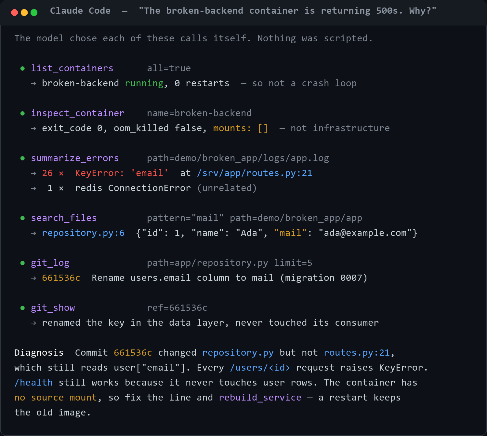
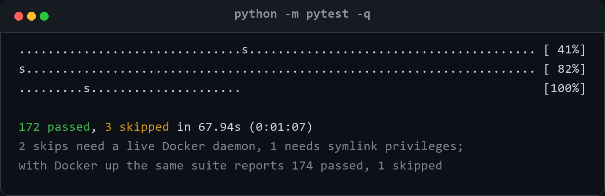
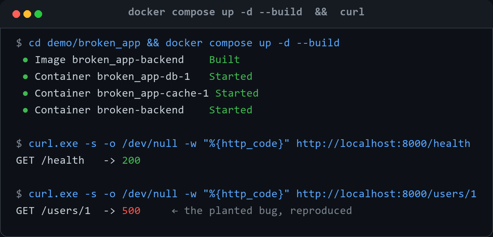
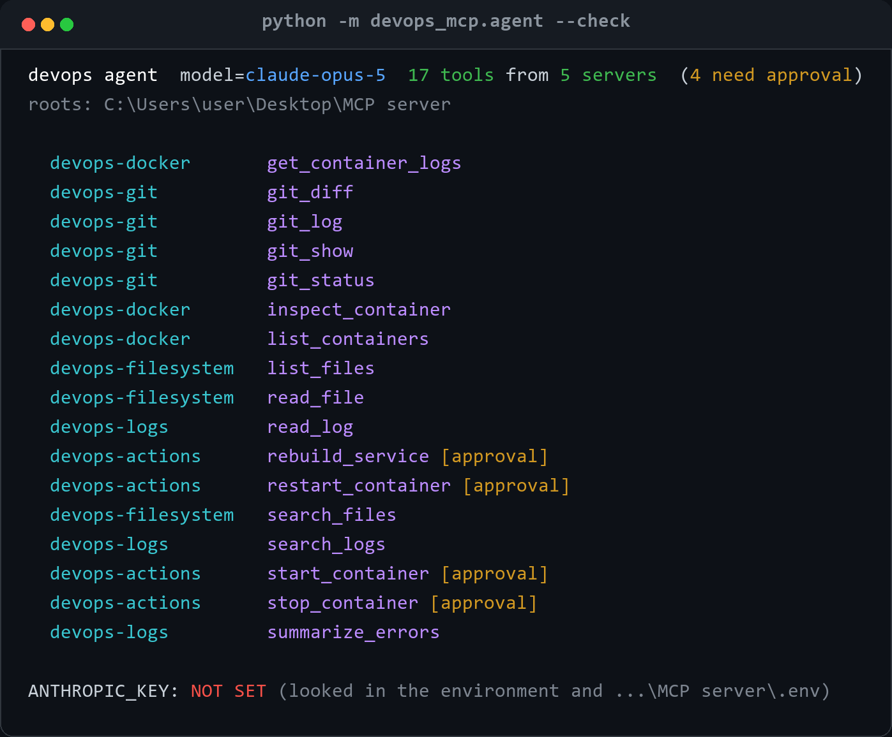
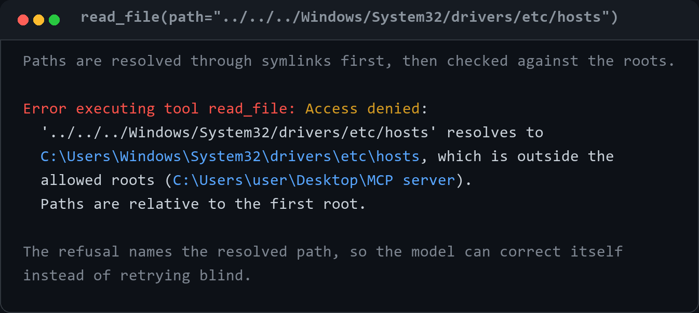
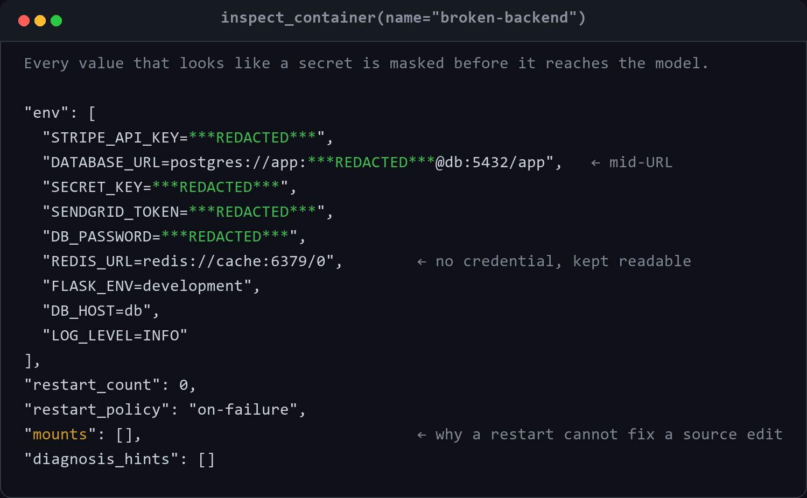
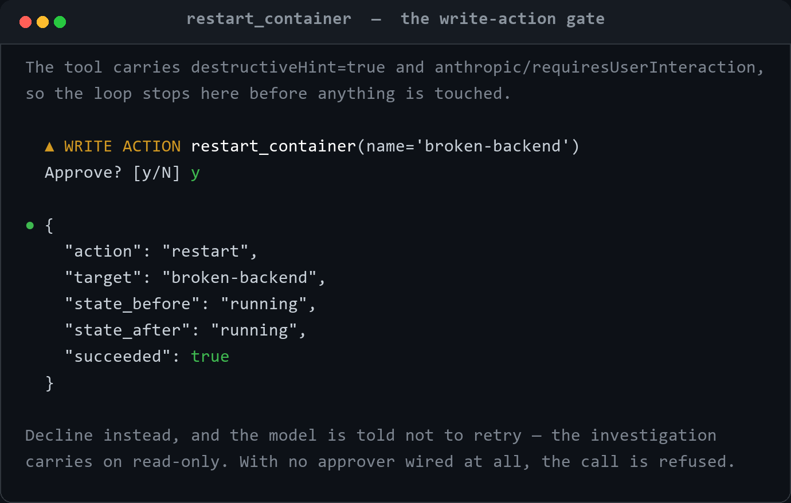

# AI DevOps Assistant

**Natural-language debugging of a local development environment, powered by MCP.**

Instead of manually checking containers, tailing logs, grepping source and reading git history,
you ask a question in plain English and an AI agent investigates it for you:

> *My API started returning 500 errors after my latest changes. Find out why.*

The agent decides which tools it needs, calls them through the Model Context Protocol, and comes
back with a diagnosis. It never receives a dump of your system — it gets a set of capabilities and
chooses among them, one call at a time.



Eighteen tools across five servers. Every screenshot in this README is real output, not a mockup —
see [Regenerating the screenshots](#regenerating-the-screenshots).

---

## What this is

Three things, which you can adopt separately:

1. **Five MCP servers** that expose your filesystem, git history, Docker containers and log files
   to a language model as *tools* — safely, and with a strict output budget. These work in any MCP
   client: Claude Code, the MCP Inspector, or your own.
2. **A standalone agent host** (`python -m devops_mcp.agent`) that spawns those servers, hands
   their tools to Claude, and runs the investigation loop to a conclusion. ~400 lines, so the
   safety model is *enforced* here rather than assumed.
3. **A deliberately broken demo app** whose git history contains a planted bug, so you can watch
   the whole thing work before pointing it at anything you care about.

**What it is not:** an autonomous operator. Fourteen of the eighteen tools cannot change anything,
and the four that can stop and ask a human every single time.

---

## How it works

```
        You  ──ask──▶  AI Agent  ──MCP──▶  5 stdio servers  ──▶  your environment
                          │                                        docker / git /
                          └────────  diagnosis  ◀──────────────    files / logs
```

**MCP is the bridge.** Each server is a standalone Python process speaking the Model Context
Protocol over stdin/stdout. The host starts them, collects their tool definitions, and hands those
to the model. The model picks tools; the host routes the calls. No server ever talks to the model
directly, and no server knows another exists.

A single question turns into a loop:

| Step | What happens |
|---|---|
| 1. Discover | The host spawns each server and asks for its tool list, name, schema and annotations. |
| 2. Offer | All tools are aggregated into one flat namespace and passed to the model. Name collisions are refused rather than silently shadowed. |
| 3. Choose | The model returns `tool_use` blocks. It sees only descriptions and schemas — never your files. |
| 4. Gate | Any tool annotated `anthropic/requiresUserInteraction` stops the loop and asks a human. |
| 5. Execute | The call is routed to the owning server, which sandboxes the path, runs the command, then redacts and truncates the result. |
| 6. Repeat | Results go back as one user message. The loop continues until the model stops calling tools. |

Git and Docker are driven through their CLIs as argv lists — never a shell — so there is no client
library to keep in sync and both degrade to a readable error when unavailable.

---

## Why it is built this way

Each of these is a deliberate trade, and the reason matters more than the mechanism.

### Context is the scarce resource

**A tool that dumps a 10,000-line log is worse than no tool**, because it buries the answer and
burns the budget the model needs to reason. So every tool caps its own output, states when it
truncated, and tells the model how to narrow the next call.

That constraint is why `summarize_errors` exists at all. Rather than returning log lines, it groups
repeated errors and tracebacks into *distinct problems*, ranked by severity and count, each with
the innermost code location and first/last-seen timestamps. It understands Python tracebacks
including chained ones, Docker-style timestamp-prefixed lines, and JavaScript and Java stack
frames, and it normalises request IDs, UUIDs and hex values so one problem doesn't fragment into a
hundred groups. Above, it turned 351 log lines into two facts.

### Five servers, not one

Each server is independently registrable. Running only the four read-only servers means the agent
has **no mutating tools at all — not disabled ones, absent ones**. A capability that isn't loaded
cannot be invoked by a confused model, a prompt injection, or a bug in the approval logic.

That property is worth more than the convenience of a single process. `--read-only` exercises it:
14 tools exist instead of 18.

### One safety boundary, not one per server

Every server routes through [`src/devops_mcp/safety.py`](src/devops_mcp/safety.py). Path sandboxing,
secret redaction and output truncation live in exactly one place, which is the only way to be
confident all four read paths actually enforce them. Most of the 200 tests aim at this file.

### The model is an untrusted planner

It chooses *what* to look at; it never chooses *whether* it is allowed to. Paths are resolved
through symlinks and checked against the roots. Refs and container names that reach `git` or
`docker` are validated for option injection, and paths always follow `--`. Every refusal is written
to be *read by the model*, naming the resolved path so it can correct itself instead of retrying
blind.

### Errors are evidence

An empty result is information about your query at least as often as about the system, so tools say
what they searched and how much they scanned (`files_scanned`, `lines_analyzed`, `truncated`). The
agent's system prompt pushes back explicitly on concluding "there is no history" from one empty
call.

---

## The tools

Every parameter below is optional unless marked **required**.

### `devops-filesystem` — project inspection

| Tool | Parameters | Returns |
|---|---|---|
| `list_files` | `path="."`, `depth=2`, `include_hidden=False` | Directory tree with sizes. Skips VCS, dependency and cache dirs, and honours `.gitignore`. |
| `read_file` | **`path`**, `start_line`, `end_line` | Line-numbered text so the model can cite locations. Refuses binaries; secrets redacted. |
| `search_files` | **`pattern`**, `path="."`, `glob`, `max_results=50`, `ignore_case=False` | Regex search like `grep -rn`. Structured hits of path, line, text. `glob` filters by name or path. |

### `devops-git` — change history

| Tool | Parameters | Returns |
|---|---|---|
| `git_status` | `repo="."` | Branch, ahead/behind, and staged, unstaged, untracked and conflicted files. |
| `git_diff` | `repo="."`, `staged=False`, `ref`, `path`, `stat_only=False` | Unified diff. Falls back to a `--stat` summary when the patch exceeds the output budget. |
| `git_log` | `repo="."`, `limit=15`, `ref`, `path` | Commits with author, date, subject and files-changed. `path` finds who last touched a file. |
| `git_show` | `repo="."`, `ref="HEAD"`, `stat_only=False` | One commit: metadata, message and patch. |

> `repo=` chooses **which** repository; `path=` narrows to a file **within** it. A project in a
> subdirectory is usually its own repo — reach it with `repo=<that directory>`.

### `devops-docker` — container inspection

| Tool | Parameters | Returns |
|---|---|---|
| `list_containers` | `all=True` | Name, state, status, image, ports. Non-running listed first, since those are the interesting ones. |
| `inspect_container` | **`name`** | The diagnostic subset of `docker inspect`: exit code, OOM flag, restart count and policy, health log, command, env (redacted), ports, mounts, networks. Plus `diagnosis_hints` flagging crash loops, OOM kills, exit 137/139 and failing health checks. |
| `get_container_logs` | **`name`**, `tail=200`, `since`, `timestamps=True`, `stderr_only=False` | Stdout and stderr interleaved by timestamp. |
| `probe_url` | **`url`**, `method="GET"`, `timeout=10` | Makes one HTTP request to a local service: status, timing, selected headers, redacted body, plus a `hint` naming what to check next. Closes the loop after a fix — verify rather than assume. |

> `probe_url` is deliberately limited to **GET and HEAD**, and to hosts resolving to **loopback or
> private addresses**. An unrestricted HTTP client would let the model change server state with a
> POST and walk straight around the approval gate on `devops-actions`. Set `DEVOPS_MCP_HTTP_HOSTS`
> to allow a specific public host.

### `devops-logs` — log analysis

| Tool | Parameters | Returns |
|---|---|---|
| `summarize_errors` | **`path`**, `max_groups=10`, `max_lines=50000` | **Start here.** Groups repeated errors and tracebacks into distinct problems, ranked by severity and count. |
| `search_logs` | **`path`**, **`pattern`**, `context=2`, `max_results=30`, `ignore_case=True`, `max_lines=50000` | Regex hits with surrounding context lines, plus a total match count. |
| `read_log` | **`path`**, `tail=200` | Raw recent lines, numbered. Reads large files from the end without loading them whole. |

### `devops-actions` — write operations, **human approval required**

| Tool | Parameters | Returns |
|---|---|---|
| `restart_container` | **`name`**, `timeout=10` | State before and after, and whether it stayed up. |
| `stop_container` | **`name`**, `timeout=10` | SIGTERM then SIGKILL after `timeout`. Container is stopped, not removed. |
| `start_container` | **`name`** | State before and after. |
| `rebuild_service` | **`compose_dir`**, `service`, `no_cache=False` | `docker compose up -d --build`. The step that makes a source edit take effect when a container has no bind mount — restarting alone keeps the old image. |

Each action reports container state before and after, so the agent verifies the result instead of
assuming it.

---

## Quick start

```bash
pip install -e ".[dev,agent]"     # agent extra pulls in the Anthropic SDK
python -m pytest                  # 200 tests; the Docker ones skip without a daemon
```



The suite never requires Docker. Tests that need a real daemon are marked `docker` and skip
themselves when one isn't reachable, so a clean checkout is green either way.

The servers are registered for Claude Code in [`.mcp.json`](.mcp.json) at project scope. Open this
folder in Claude Code, approve the servers when prompted, then check `/mcp`. To poke at a single
server by hand, `mcp dev src/devops_mcp/servers/filesystem.py` opens the MCP Inspector.

**Which interpreter runs the servers.** `.mcp.json` launches them with
`${DEVOPS_MCP_PYTHON:-python}`, so by default they use whatever `python` is on `PATH` — correct
when you start Claude Code from an activated venv or conda env. If your `python` is something else,
point the variable at the right interpreter instead of editing the committed file:

```jsonc
// .claude/settings.local.json — gitignored, so your path never reaches the repo
{
  "env": { "DEVOPS_MCP_PYTHON": "/absolute/path/to/env/bin/python" }
}
```

On Windows that is `...\env\Scripts\python.exe`. Getting this wrong is the single most likely
reason all five servers fail to connect at once: the interpreter starts but has no `devops_mcp`
installed, so every server exits immediately.

### Try it

Build the demo target — a git repo whose history contains a deliberately planted bug:

```bash
python scripts/make_demo.py      # creates demo/broken_app (gitignored)
```

Ask, without Docker:

> The app in `demo/broken_app` started returning 500s after recent changes. What broke?

Or run the real thing:

```bash
cd demo/broken_app
docker compose up -d --build
curl.exe http://localhost:8000/users/1     # 500; use curl.exe on PowerShell, not the alias
```



> The broken-backend container is returning 500s. Why?

Add *"use only the devops MCP tools"* to the question. Otherwise the agent may reach for its
built-in file tools, which is faster but proves nothing about these servers. Tear down with
`docker compose down`.

---

## The agent

The five servers are only half the system — something has to *drive* them. `devops_mcp.agent` is a
standalone host that does exactly that: it spawns the servers over stdio, hands their tool
definitions to Claude, and runs the investigation loop until the model reaches a diagnosis.

```bash
cp .env.example .env          # then put your key in it; .env is gitignored
python -m devops_mcp.agent --check                     # verify credentials + tool discovery
python -m devops_mcp.agent "The broken-backend container is returning 500s. Why?"
```

`--check` is the fastest way to confirm the whole chain works. It spawns all five servers, lists
what they offer, and reports credential status — and it works without a key:



| Flag | Meaning |
|---|---|
| `--roots PATH` | Directory the tools may touch (repeatable). Sets `DEVOPS_MCP_ROOTS` for the child servers. |
| `--read-only` | Do not start `devops-actions`. The agent has no mutating tools at all. |
| `--servers A,B` | Explicit server list. |
| `--yes` | Auto-approve write actions. Non-interactive runs decline by default. |
| `--model` | Override the model (default `claude-opus-5`). |
| `--max-turns` | Safety stop for a runaway loop (default 40). |
| `--check` | List discovered tools and credential status, then exit. Works without a key. |

### Credentials

The key lives in `.env` as **`ANTHROPIC_KEY`** and is passed to the SDK client explicitly.
That is deliberate: the SDK's default `ANTHROPIC_API_KEY` is picked up implicitly from the
environment, so a stray value in your shell could silently decide which account gets billed.
`src/devops_mcp/llm.py` is the only place credentials are read.

The API's built-in MCP connector only speaks to remote URL servers. These are local stdio
processes, so `agent/bridge.py` is the connector — it aggregates tools across servers, refuses
name collisions, and passes the environment through so `DEVOPS_MCP_ROOTS` actually reaches them.

---

## Safety

The boundary lives in one place, [`src/devops_mcp/safety.py`](src/devops_mcp/safety.py), and every
server routes through it.

### Path sandbox

Every path is fully resolved, symlinks included, and must land inside an allowed root. Traversal,
absolute escapes and symlink escapes are refused with an error the model can read and correct:



### Secret redaction

Secret-shaped keys (`*PASSWORD*`, `*TOKEN*`, `*API_KEY*`, …), credentials embedded in URLs, PEM
blocks, bearer tokens and known token shapes are masked in every file, search, log, diff and
container-env result. Config files stay readable, which matters because that's usually where the
bug is:



### Output budget

No result exceeds the configured size. Truncated results say so and explain how to narrow the query.

### No option injection

Model-supplied refs, paths and container names that reach `git` or `docker` are validated (no
leading `-`, no shell metacharacters) and paths always follow `--`. Commands are argv lists with
timeouts; no shell is ever invoked.

### Write actions

`devops-actions` is the only server that changes anything, and three independent guards stack:

1. **Opt-in by registration.** Remove it from `.mcp.json`, or pass `--read-only`, and the agent has
   no mutating tools at all.
2. **Operator control.** `DEVOPS_MCP_ALLOW_ACTIONS=0` disables every tool;
   `DEVOPS_MCP_ACTION_CONTAINERS` scopes them to named containers, so the agent can be allowed to
   restart your dev stack but never a database you happen to be running locally.
3. **Human approval per call.** Each tool is annotated `destructiveHint` and carries
   `anthropic/requiresUserInteraction`, which forces a prompt on every call with no "don't ask
   again" option.



Two details make the gate more than a dialog box. **Declining is a real answer** — the model
receives an error result telling it not to retry, and the investigation continues read-only.
**With no approver wired, an approval-gated tool cannot run**: the default is refusal, not silent
execution.

The agent's system prompt also tells it to diagnose *before* proposing an action, because
restarting a container destroys the evidence of why it failed.

---

## Configuration

| Variable | Default | Meaning |
|---|---|---|
| `DEVOPS_MCP_ROOTS` | `CLAUDE_PROJECT_DIR`, else cwd | Directories the tools may touch, separated by `;` on Windows and `:` elsewhere. Relative paths resolve against the first. |
| `DEVOPS_MCP_MAX_LINES` | `400` | Max lines in any tool result. |
| `DEVOPS_MCP_MAX_BYTES` | `65536` | Max bytes in any tool result. |
| `DEVOPS_MCP_ALLOW_ACTIONS` | `1` | Set to `0` to disable every write tool. |
| `DEVOPS_MCP_ACTION_CONTAINERS` | *(all)* | Glob allowlist scoping which containers write tools may touch, e.g. `broken_app-*,broken-backend`. |
| `DEVOPS_MCP_HTTP_HOSTS` | *(none)* | Comma-separated hosts `probe_url` may reach beyond loopback and private addresses. |
| `DEVOPS_MCP_MODEL` | `claude-opus-5` | Model the agent host uses. |
| `DEVOPS_MCP_PYTHON` | `python` | Interpreter `.mcp.json` launches the servers with. |

Point `DEVOPS_MCP_ROOTS` at a real project to investigate it.

---

## Layout

```
src/devops_mcp/
  config.py          settings read from the environment
  safety.py          path sandbox, secret redaction, output truncation
  shell.py           subprocess wrapper — argv lists, timeouts, never a shell
  docker_client.py   shared docker CLI plumbing and error translation
  llm.py             the only place the Anthropic credential is read
  servers/
    filesystem.py    list_files / read_file / search_files
    git.py           git_status / git_diff / git_log / git_show
    docker.py        list_containers / inspect_container / get_container_logs / probe_url
    logs.py          read_log / search_logs / summarize_errors
    actions.py       restart / stop / start / rebuild   (approval-gated)
  agent/
    bridge.py        spawns the servers, aggregates their tools, routes calls
    session.py       the tool loop, approval gate, refusal + turn limits
    __main__.py      the CLI
fixtures/broken_app/ deliberately broken Flask app used by tests and demos
scripts/
  make_demo.py       builds demo/broken_app with a bug-introducing commit in its history
  render_docs.py     regenerates the screenshots in docs/img
  probe_flags.py     retired diagnostic, kept as an MCP annotation reproduction
docs/img/            the screenshots in this README
tests/               200 tests, mostly on the safety boundary and the approval gate
```

Each server runs standalone: `python -m devops_mcp.servers.<name>`.

Requires Python 3.10+ and the `mcp` SDK 2.x. Git and Docker are invoked through their CLIs, so
neither needs a client library, and both degrade to a readable error when unavailable.

---

## Regenerating the screenshots

The images in `docs/img/` are rendered from transcripts captured by actually running the commands —
they are not mockups, and they are not hand-drawn. The transcripts live as string constants at the
bottom of [`scripts/render_docs.py`](scripts/render_docs.py):

```bash
pip install -e ".[docs]"
python scripts/render_docs.py
```

If you change a tool's output, re-run the command, paste the new text in, and re-render, so the docs
cannot drift away from the code. The renderer fails loudly on a glyph the font cannot draw rather
than emitting a box.
